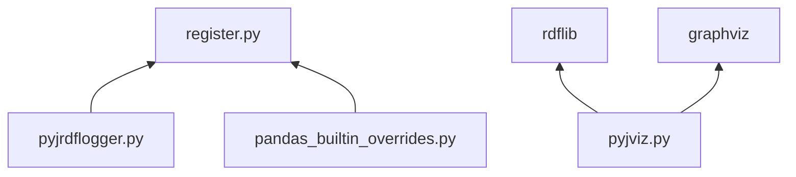

# dependencies



# register.py
[pyjviz-poc/janitor/register.py](https://github.com/asmirnov69/pyjviz-poc/blob/main/janitor/register.py) is modified from [original version](https://github.com/Zsailer/pandas_flavor/blob/master/pandas_flavor/register.py) used by pyjanitor via import of [pandas_flavor](https://github.com/Zsailer/pandas_flavor) module. The change made in *`__call__`*  method of class *AccessorMethod*. POC code uses global object *pandas_call_reporting_obj* to delegate handling of pyjanitor method call args.

# functions/pandas_builtin_overrides.py
[pyjviz-poc/janitor/functions/pandas_builtin_overrides.py](https://github.com/asmirnov69/pyjviz-poc/blob/main/janitor/functions/pandas_builtin_overrides.py) creates *pyjanitor* version of selected dataframe methods. Overrides themselves do nothing - just passing result of original *pandas* call to the caller. However *pyjanitor* registration will allow call information to be passed to configured *pandas_call_reporting_obj* so pandas methods will be treated the same way as any registered *pyjanitor* method.

# pyjrdflogger.py
[pyjviz-poc/janitor/pyjrdflogger.py](https://github.com/asmirnov69/pyjviz-poc/blob/main/janitor/pyjrdflogger.py) is module with main responsibility to provide convenience methods to create and append [[RDF as tool for software engineering]] triples to rdf logfile. 

NOTE that creating of rdf log does not require any external modules. Triples corresponding to objects and events are created as formatted strings and then saved using standard IO facilities. Check [[RDF as tool for software engineering]] on more details.

## class *RDFLogger*
Static method *RDFLogger.init* suppose to be called before program execution starts to open rdf log file and setup global *pandas_call_reporting_obj* from *register.py* to point to instance of *RDFLogger*. 
Class *RDFLogger* implements method *handle_dataframe_method_call* where the logic of rdf log is defined. It saves information like called method name, arguments and id of dataframes in RDF turtle format using predefined structure [[tbc]]

## class *ChainedMethodsCall*
Class *ChainedMethodsCall* is a wrapper which can be used along with language idiom - lambda with empty argument list. It creates convenient syntax for chained methods call:

```python
res = a.m1().m2().m3() # chained method call
...
cmc = ChainedMethodsCall("3m call", lambda: a.m1().m2().m3())
res = cmc.run() # the same as a.m1().m2().m3()
...
res = run_cmc("3m call", lambda: a.m1().m2().m3()) # one-liner, the same actions as above
```

Also *ChainedMethodsCall* class implementation can be used to place addition information to rdf log to create named group (or subgraph) corresponding to particular CMC. Such named group would allow visual segmentation of execution flow which seems to be useful for 'big picture' overviews.

# pyjviz.py
[pyjviz-poc/janitor/pyjviz.py](https://github.com/asmirnov69/pyjviz-poc/blob/main/janitor/pyjviz.py) is to provide basic visualization of rdf log file. There are no required dependency on other pyjanitor modules. pyjviz.py uses two modules: [rdflib](https://rdflib.readthedocs.io/en/stable/) and [graphviz](https://github.com/xflr6/graphviz) to implement pipe execution trace graph rendering using rdf log file produced by [RDFLogger](https://github.com/asmirnov69/pyjviz-poc/blob/main/janitor/pyjrdflogger.py). rdflib provides [[SPARQL]] implementation which used to query rdf log triples dataset. The SPARQL queries results then formatted to produce graphviz [[dot]] in-memory file. Using python [[graphviz]] function the content of [[dot]] file then transformed into .png file.
