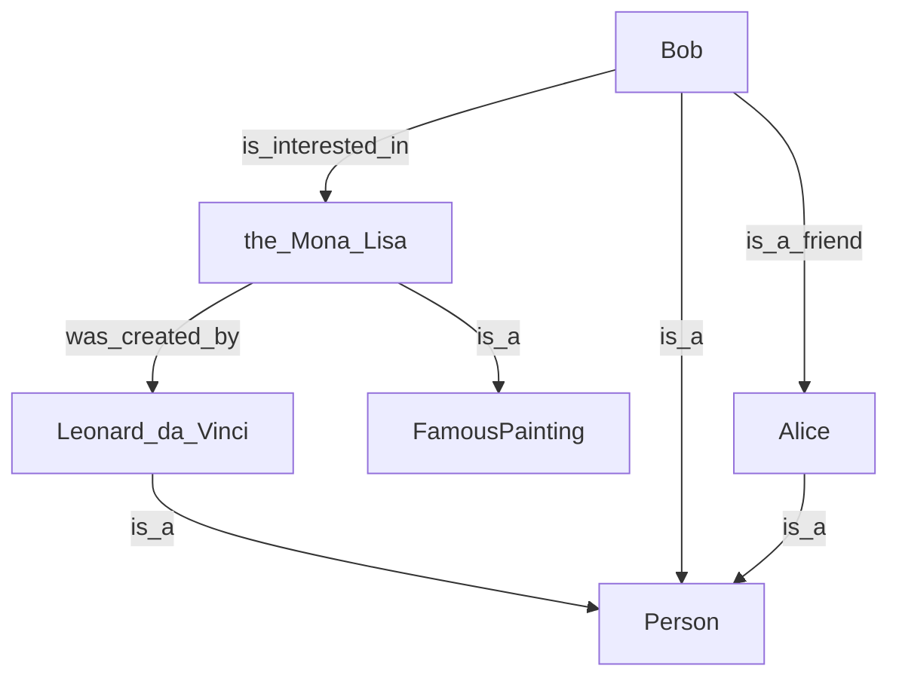

# Intro

RDF is [Resource Definition Format](https://www.w3.org/RDF/) introduced to standardize particular knowledge graph representation which uses *triples*. To get better idea look at this examples from [RDF 1.1 Primer](https://www.w3.org/TR/rdf11-primer/) First example from section 3.1 looks like most important so I will use that below.

RDF dataset is actually set of *triples* where each triple has parts called *subject*, *predicate* and *object*:
```
<Bob> <is_a> <Person> .
<Bob> <is_a_friend> <Alice> .
<Alice> <is_a> <Person> .
<Bob> <is_born_on> "19900704" .
<Bob> <is_interested_in> <the_Mona_Lisa> .
<Mona_Lisa> <was_created_by> <Loenard_da_Vinci> .
<Bob> <visits_very_often_the_website> <https://www.google.com> .
<Loenard_da_Vinci> <is_a> <Person> .
<the_Mona_Lisa> <is_a> <FamousPainting> .
```

`<Bob>`, `<Alice>` are either *subjects* or *objects* depending on triple. `<is_a>`, `<is_born_on>` are *predicates*. 

`<Bob>`, `<Alice>`, `<is_a>`, `<is_born_on>`, `<https://www.google.com>` - are all examples of [URI](https://en.wikipedia.org/wiki/Uniform_Resource_Identifier) - Universal Resource Identifier. For practical purposes you should know that all URLs (like https://www.google.com) are actually URIs.
Also RDF introduces literals which are used to represent constants. Triple `<Bob> <is_born_on> "19900704"` has *object* (third triple element) which is literal string.

The angle brackets used in listing above are not part of URI itself. It is part of certain choice of language used to represent RDF dataset. In all examples we use [turtle](https://www.w3.org/TR/turtle/) RDF representation.

Footnote: there are few more useful details to be aware about URI (and IRI) -> https://stackoverflow.com/a/34147086/1181482
Footnote: URL to google looks like `<https://www.google.com>` - it is also URI. Meanwhile `<Bob>` is URI but not URL since it doesn't have parts prescribed to valid URL to have (like above mentioned google URL has *protocol* value set to **https**).  I.e. URLs have some additional precise and useful meaning - you can use them in web browser. This is something we can't say about URIs in general.

Now we can look at graph representation of some of RDF statements from listing above:



As you see RDF statements form *directed graph with labeled edges*. Nodes of this graph are either *subjects* or *objects*, edges are always *predicates*. Note that RDF graph is defined using single of set triples - it is different from usual [definition of directed graph via node set and separate edge set](https://en.wikipedia.org/wiki/Directed_graph).

# How object-oriented oriented programming is related to example above?

Object-oriented programming (OOP) is related to RDF listing and RDF graph from section above is very important way. Both OOP and RDF introduce *classes*. E.g. example of python code below defines class *Person* and class *FamousPainting* and all additional objects to create setup logically equivalent to RDF dataset and graph from prev section

```python
class Person:
	def __init__(self):
		self.is_a_friend = None
		self.is_interested_in = None
		self.visits_very_often_website = None

class FamousPainting:
	def __init__(self):
		self.was_created_by = None

bob = Person()
alice = Person()
leonardo = Person()
bob.is_a_friend = alice

joconda = FamousPainting()
joconda.was_created_by = leonardo
bob.is_interested_in = joconda
```

Interesting question to ask at this point: why there is no *is_a* mention in `__init__` method of both python classes.

The reason why no *is_a* mentioned is it is not necessary since we specify this piece of knowledge when we create python objects of particular python class. I.e. when RDF triple with predicate *is_a* is created it can be interpreted in python code just statement like
```python
bob = Person()
```

Then it become clear what are *Person* and *FamousPainting* in RDF listing are - THEY are *classes*. I.e. Bob, Alice, Leonardo Da Vinci belong to class *Person*. Mona Lisa painting is actually a well-known instance (or OOP object) which belongs to class *FamousPainting*.

This is fundamental observation and it is stated in RDF-based knowledge bases using special predicate [rdf:type](https://en.wikipedia.org/wiki/RDF_Schema)
# Alternative view on classes
[[tbc]]

# Bad news

Fundamental observation that example with Bob, Alice and Mona Lisa uses `rdf:type` named as `is_a` predicate is actually good news.

Bad news here is that in the field of knowledge base the learning curve deviates from being practical and quickly become something very abstract and practically useless for most of us - especially if you writing code and use it to interact with data. You can see that on examples of section 'RDFS entailment' of https://en.wikipedia.org/wiki/RDF_Schema - this mention things like OWL, entailment regime. It is all abstract logic concepts where some tools are available. But for the purpose of practical use such tools are useless just because very quickly you will arrive to the field of NP-complete problems and other interesting but completely impractical things (more things about that). [[tbc]]

So this is bad news.

# Good news

But there are good news in the RDF world. 

## SPARQL

The first really good news is once you defined something using RDF you can immediately start using [[SPARQL]]:

```
select ?p ?pi 
where { 
 ?p rdf:type <Person> . 
 ?p <is_interested_in> ?i . 
 ?i rdf:type <FamousPainting> .
}
```

You can really quickly execute query above using python code ... which uses [rdflib](https://rdflib.readthedocs.io/en/stable/)
The query will give all persons interested in famous paitings.

[[tbc]] more complicated example with painting class hierarchies

## SHACL

^ac6f28

The other good news is you can create RDF dataset and use [[SHACL]] tools to verify that practically important constrains are not violated.
This would address serious problem with practical usage of RDF datasets. Since RDF itself does not mandate anything about triples you can quickly arrive to chaotic situation when e.g. Bob may have two birthdays defined:

...

Another situation could be when someone will add triple declaring Mona Lisa to be a Person.

All that issues and more can be addressed by SHACL schema which should accompany your RDF dataset. It is very similar to relational (SQL) database schema - but much more flexible in very important way.

This is really good news: SHACL support subclassing. I.e you can quickly do following and still will be able to run validation. 

## Neo4J and opencypher

Neo4J is graph database which uses approach to data representation different from RDF. It called LPG - Labeled Property Graph. Neo4J itself is quite popular system and used in cert
