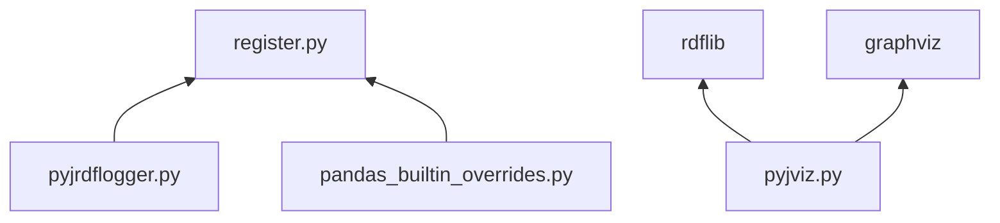

[pyjviz-poc][] is github repo with proposal to implement [pyjanitor][] transforms visualization using [[RDF]] -related tools.

# Code highlights

## dependencies



## register.py
[pyjviz-poc/janitor/register.py](https://github.com/asmirnov69/pyjviz-poc/blob/main/janitor/register.py) is modified from [original version](https://github.com/Zsailer/pandas_flavor/blob/master/pandas_flavor/register.py) used by [pyjanitor][] via import of [pandas_flavor][] module. The change made in *`__call__`*  method of class *AccessorMethod*. POC code uses global object [*pandas_call_reporting_obj*][] to delegate handling of [pyjanitor][] method call args.

## functions/pandas_builtin_overrides.py
[pyjviz-poc/janitor/functions/pandas_builtin_overrides.py](https://github.com/asmirnov69/pyjviz-poc/blob/main/janitor/functions/pandas_builtin_overrides.py) creates [pyjanitor][] version of selected dataframe methods. Overrides themselves do nothing - just passing result of original [pandas][] call to the caller. However [pyjanitor][] registration will allow call information to be passed to configured [*pandas_call_reporting_obj*][] so pandas methods will be treated the same way as any registered [pyjanitor][]'s method.

## pyjrdflogger.py

### class RDFLogger
Class [*RDFLogger*][] implements method [*handle_dataframe_method_call*][] where the logic of rdf log is defined. It saves information like called method name, arguments and id of dataframes in RDF turtle format using predefined structure [[tbc]] 
NOTE that creation of rdf log does not require any external modules. Triples corresponding to the objects and events are created as formatted strings and then saved using standard IO facilities. Check [[RDF]] on more details.

Static method [*RDFLogger.init*](https://github.com/asmirnov69/pyjviz-poc/blob/29f16f1ae39ac6e6d5338bb424781681b3572a1a/janitor/pyjrdflogger.py#L48) suppose to be called before program execution starts to open rdf log file and setup global *pandas_call_reporting_obj* from *register.py* to point to instance of *RDFLogger*. 

### class ChainedMethodsCall
Class [*ChainedMethodsCall*][] is a wrapper which can be used along with language idiom - lambda with empty argument list. It creates convenient syntax for chained methods call:

```python
res = a.m1().m2().m3() # chained method call
...
cmc = ChainedMethodsCall("3m call", lambda: a.m1().m2().m3())
res = cmc.run() # the same as a.m1().m2().m3()
...
res = run_cmc("3m call", lambda: a.m1().m2().m3()) # one-liner, the same actions as above
```

Also [*ChainedMethodsCall*][] class implementation can be used to place addition information to rdf log to create named group (or subgraph) corresponding to particular CMC. Such named group would allow visual segmentation of execution flow which seems to be useful for 'big picture' overviews.

## pyjviz.py
[pyjviz-poc/janitor/pyjviz.py](https://github.com/asmirnov69/pyjviz-poc/blob/main/janitor/pyjviz.py) is to provide basic visualization of rdf log file. There are no required dependency on other [pyjanitor][] modules. pyjviz.py uses two modules: [rdflib](https://rdflib.readthedocs.io/en/stable/) and [graphviz](https://github.com/xflr6/graphviz) to implement pipe execution trace graph rendering using rdf log file produced by [RDFLogger](https://github.com/asmirnov69/pyjviz-poc/blob/main/janitor/pyjrdflogger.py). rdflib provides [[SPARQL]] implementation which used to query rdf log triples dataset. The SPARQL queries results then formatted to produce graphviz [[dot]] in-memory file. Using python [[graphviz]] function the content of [[dot]] file then transformed into .png file.

# Implementation plan

The steps to implement the proposal as set of new pyjanitor features are outlined below.

## modifications in pandas_flavor module

[pandas_flavor](pandas_flavor.md) has to be done to place method call interception logic to (optionally) pass of collected method call name and args to [[RDFLogger]] methods. [README](README.md) provides its own version of register.py to implement required logic for the case of pandas dataframe - https://github.com/asmirnov69/pyjviz-poc/blob/ab322f5342f9471bfb9d748bf551bb7f3d5a333e/janitor/register.py#L48
All other cases supported by [pyjanitor](pyjanitor.md) would require similar modifications.

## modifications in pyjanitor module

### add functions/pandas_builtin_overrides.py
*functions/pandas_builtin_overrides.py* replaces pandas methods with registered by [[pyjanitor]] version to handle method call intercept using [pyjanitor](pyjanitor.md) standard approach using *register* wrapper.
NOTE that similar implementation is required for all other packages supported by [pyjanitor](pyjanitor.md) -- spark, xarrays [[tbc]]`provide full and verified list`

### add pyjrdflogger.py 
^041966
*pyjrdflogger.py* contains implementation of classes [[RDFLogger]] and [[ChainedMethodsCall]]. 
[[RDFLogger]] provides methods to handle intercepted [[pyjanitor]] method calls and store corresponding RDF triples into rdf logfile.
[[ChainedMethodsCall]] is to be used by [[pyjanitor]] users. It allow to create [[pyjanitor]] transforms as python objects which hold additional relevant information besides transforms themselves.
NOTE that neither class introduce additional dependencies if *RDFLogger* is used to produce RDF log in the file form.

### add pyjviz.py
*pyjviz.py* implementation uses [[rdflib]] and [graphviz](graphviz.md) modules. Those are new dependencies for *pyjanitor*. Strictly speaking *pyjviz.py* doesn't have to be part of [[pyjanitor]] module. [[rdflib]] is used to build and query graph created by [[RDFLogger]] using system IO facilities only.

# Further development

^d40b47

## introduce SHACL schema for RDFLogger output
SHACL schema provide the way to describe the [RDFLogger](RDFLogger.md) output using SHACL definitions. It will provide the way to start using rdf logs as parts of bigger knowledge bases.

## user-defined additions to RDFLogger output
[[tbc]]users of *pyjanitor* would possibly find useful ways of feature where they can insert additional rdf triples into rdf logs produced by their code. applications are numerous - visualizations, data catalogs, support for data exploration, ETL support.

## build pyjanitor code static analysis and visualizer
It seems to be possible task to write python code for static analysis and visualization of [ChainedMethodsCall](ChainedMethodsCall.md) usage in user's and other related to *pyjanitor* code which will be based [python3 annotations](python3%20annotations) and code docstrings. The tool will generate rdf dataset which could be compatible with [RDFLogger](RDFLogger.md) output. Main purpose of doing that would be to allow visualizations of *pyjanitor* code before run-time.

## build GUI browser for exploration of RDFLogger and similarly produced  RDF datasets
This is very big task in graph database visualization space. It could be started as separate related project to address some immediate needs of [pyjanitor](pyjanitor.md) users and outline the way how more comprehensive system should look like.

<hr>

[pyjanitor]: https://github.com/pyjanitor-devs/pyjanitor
[pyjviz-poc]: https://github.com/asmirnov69/pyjviz-poc
[pandas_flavor]: https://github.com/Zsailer/pandas_flavor
[pandas]: https://en.wikipedia.org/wiki/Pandas_(software)
[pandas_call_reporting_obj]: https://github.com/asmirnov69/pyjviz-poc/blob/29f16f1ae39ac6e6d5338bb424781681b3572a1a/janitor/register.py#L31
[RDFLogger]: https://github.com/asmirnov69/pyjviz-poc/blob/29f16f1ae39ac6e6d5338bb424781681b3572a1a/janitor/pyjrdflogger.py#L46
[handle_dataframe_method_call]: https://github.com/asmirnov69/pyjviz-poc/blob/29f16f1ae39ac6e6d5338bb424781681b3572a1a/janitor/pyjrdflogger.py#L102
[ChainedMethodsCall]: https://github.com/asmirnov69/pyjviz-poc/blob/29f16f1ae39ac6e6d5338bb424781681b3572a1a/janitor/pyjrdflogger.py#L29
